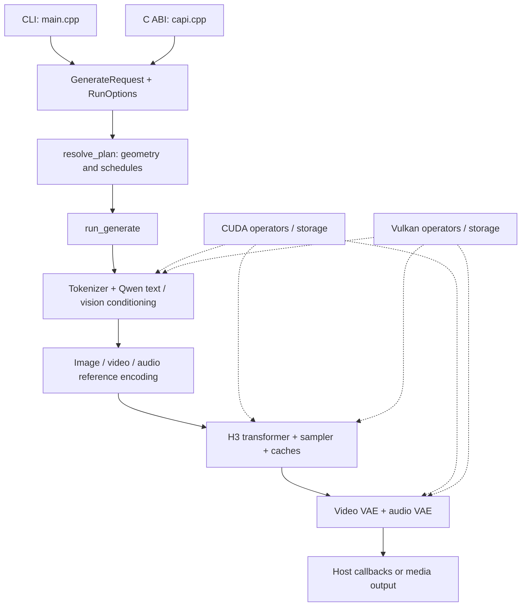

# Architecture review and model extensibility

Reviewed on 2026-09-20 with separate model, pipeline, and backend reviews. The source inventory and original line references below use commit `ed34677`; accompanying sampling-settings changes are described separately. Counts are physical lines, including comments and blank lines. This is an implementation roadmap, not a claim that arbitrary model families already run.

The central recommendation is to separate **model contracts**, **generation defaults**, and **backend capabilities**. Existing H3 variants often need different data, not different orchestration. A genuinely different transformer, conditioner, or VAE still needs an implementation of its graph. Settings should select and configure supported implementations rather than imply that any combination of dimensions and flags will work.

## Current architecture



The diagram shows responsibilities, not a promise of one fixed reference/text ordering: reference preparation and conditioning are interleaved where multimodal inputs require it. The runner deliberately releases large stage models between conditioning, denoising, and decoding to fit memory budgets. Preserve that lifetime policy while extracting modules; an abstraction that accidentally retains all stages would be a regression. See [pipeline lifecycle](../include/slopfab/pipeline.h#L1) and [runner](../src/generate.cpp#L329).

Useful foundations already exist:

- [DeviceTensorView and DeviceWorkspace](../include/slopfab/device_tensor.h#L34) provide backend-neutral storage views and workspace contracts.
- [VideoVaeWindowBackend](../include/slopfab/vae/vit_decoder.h#L79) separates shared temporal/spatial decode scheduling from device execution.
- [Checkpoint detection](../src/dit/checkpoint.cpp#L49), quantization helpers, explicit sequence layouts, and the host-side planning phase provide places to resolve and validate contracts before expensive uploads.
- Exact CUDA/Vulkan captures and replay tests preserve numerical behavior across refactors. Strict shape and layout checks are valuable safeguards, not obstacles to remove indiscriminately.

## First implementation slice: sampling defaults as data

The accompanying change introduces [SamplingSettings](../include/slopfab/sampling_settings.h), its [strict parser and compatibility recipes](../src/core/sampling_settings.cpp), and a [sampling plan resolver](../src/sampling_plan.cpp). This is a deliberately narrow first slice of the design below.

The version-1 `slopfab.sampling` SafeTensors metadata entry is a JSON string with optional `video_sigma_shift`, `audio_sigma_shift`, and `base_sigmas`. The same settings object can supply explicit request overrides. A grid contains unshifted sigma points, including terminal zero; the scheduler applies the resolved modality-specific shifts. Named schedules remain compatibility recipes.

```json
{
  "version": 1,
  "video_sigma_shift": 12,
  "audio_sigma_shift": 3,
  "base_sigmas": [1, 0.5, 0]
}
```

Resolution proceeds from H3/legacy compatibility defaults to model metadata, enabled LoRA metadata, then explicit request settings. An explicitly selected named schedule is a request-level recipe; individual request fields override that recipe. Conflicting LoRA defaults require an explicit override of the conflicting field instead of depending on adapter order. Zero-strength adapters contribute no sampling defaults. The resolved plan owns the actual grids consumed by execution.

This moves sampling recipes into data without advertising a new transformer family. FastH3's trained-grid requirements and fixed-grid incompatibilities remain checked. The schema intentionally does not accept arbitrary architecture, attention, or cache fields. Guidance, geometry, conditioner behavior, and general family manifests below are follow-up proposals, not fields supported by this first schema. See the accompanying change's tests and user documentation for its final public entry points.

## Recommended boundaries

| Layer | Owns | Examples | Must not do |
|---|---|---|---|
| Model profile | Validated checkpoint facts, component identities, compatible default recipe | Transformer family, tensor layout, latent channels, VAE normalization, text feature contract, default sigma grid | Pretend settings can supply missing weights or change a trained graph |
| Adapter profile | Compatible base family/targets, asset requirements, optional generation defaults | LoRA aliases, alpha conventions, AdaLN grid identity, distilled schedule | Override backend safety or silently change unrelated defaults |
| Request settings | User intent, with explicit presence for overrides | Steps, seed, requested recipe, guidance, reference strengths | Reconstruct defaults independently in each front end |
| Family implementation | Actual model computation and semantic preprocessing | H3 packing/modulation, Qwen conditioning, VAE frame mapping | Identify releases by filename throughout execution |
| Backend capabilities and plans | Supported operators/shapes/arithmetic, device limits, kernel/workspace selection | Exact attention shapes, quantization support, residency plan | Invent trained model defaults |
| Generation session | Device ownership, caches, resource lifetimes, cancellation, profiling | Repeated requests on a selected device | Store mutable execution state in process-wide globals |

Prefer small component contracts over a universal graph interpreter at this stage. A `ResolvedModel` can identify transformer, conditioner, codec and packing implementations; those implementations can share operators. H3 variants with the same graph should usually differ only in profile data. A new graph should implement the appropriate component interface and reuse the same request/session machinery.

## Priority 1: resolve settings and capabilities once

### Remove release identity from ordinary behavior selection

[TransformerArchitecture](../include/slopfab/dit/checkpoint.h#L11) mixes graph distinctions with release names. [checkpoint.cpp](../src/dit/checkpoint.cpp#L16) uses filename/source recognition for Ref2VA, Viggle and FastH3; [Transformer::Impl::is_vsa](../src/dit/transformer.cpp#L749) consequently ties an attention capability to a branded enum.

Resolve separate facts such as modulation implementation, reference support, compressed-attention gates, QKV layout, quantization, and generation defaults. Explicit versioned manifests or checkpoint metadata should be authoritative after tensor validation. Legacy filename heuristics may supply a fallback profile for existing downloads, with their inferred origin visible in plan descriptions. Renaming a checkpoint with an explicit profile should not change behavior.

Do not replace release enums with unchecked booleans spread through the code. Build one validated descriptor, then select a supported graph/capability combination. For example, enabling compressed attention must require the expected gate tensors and a compatible backend plan.

### Unify front-end defaulting and validation

The original Animate paths demonstrate drift: [CLI defaulting](../src/main.cpp#L1462) changes steps only when unspecified, [C API setup](../src/capi/capi.cpp#L641) overwrites steps/schedule/sampler, and a direct C++ request retains its ordinary default unless the caller changes it. Compatibility validation also appears in the planner, CLI and [runner](../src/generate.cpp#L338).

Use optional values or an explicit override mask for input settings. Resolve all default sources into an immutable effective plan and validate it once. Front ends should only parse/copy requests and report errors. Runtime checks should enforce resource or tensor invariants that genuinely become knowable later.

The broader resolver should expose each effective setting's source, distinguish default suggestions from hard compatibility requirements, reject unknown schema versions/fields, and reject invalid combinations before allocating device memory. Adapter defaults should never become an accidental last-adapter-wins policy. Continue the first slice's conflict checks as additional settings become configurable.

### Split checkpoint semantics from backend limitations

[EncoderConfig](../include/slopfab/text/encoder.h#L107) exposes dimensions, but [Vulkan text loading](../src/vulkan/text_encoder.cpp#L31) and [CUDA exact layer execution](../src/cuda/encoder_kernels.cu#L765) support particular production shapes. [Vulkan causal GQA](../src/vulkan/tensor.cpp#L5616) likewise supports a restricted 64/8/128 contract. Declare those capabilities explicitly and match the resolved model against them.

Some constraints are numerical contracts: [exact attention scales](../include/slopfab/attention.h#L11) encode specific float bits. Others arise from available kernels. Neither should become an arbitrary user override. Add a tested kernel or explicit fallback when expanding support; retain clear early rejection otherwise.

## Priority 2: make model contracts consistently configurable

### Geometry, packing, positions and codec contracts

[packing.cpp](../src/dit/packing.cpp#L12) fixes FPS 24, spatial multiple 32, frame grouping 17/5, audio latent rate 40, stereo channels and RoPE timing. Its [video patchification](../src/dit/packing.cpp#L249) and [audio layout](../src/dit/packing.cpp#L315) fix latent channel counts. [TransformerConfig::video_patch_dim](../include/slopfab/dit/transformer.h#L55) fixes a 2-by-2 patch despite exposing channel settings.

Introduce a validated latent/packing descriptor containing channel counts, patch shape, spatial compression, sample/frame rates, supported canvas constraints, and position parameters. Share it among planning, packing, denoising, codecs, archives and output metadata. Preserve H3's floating-point operation order when moving existing constants. Different temporal mappings or position algorithms belong to family implementations, with their parameters in profiles.

[VideoVaeWindowBackend](../include/slopfab/vae/vit_decoder.h#L79) is a useful seam, but returning `ViTConfig` still exposes one decoder family. Separate common latent/output geometry from family-internal layer configuration before adding a substantially different VAE. Move normalization statistics and presentation transforms into codec profiles, while retaining validated H3 defaults.

### AdaLN configuration must match implementation

`TransformerConfig` exposes rank and table rows, but [AdaLNTable](../include/slopfab/dit/adaln.h#L75) fixes rank 8 and 1025 rows and returns `std::array<float, 8>`. [LoRA basis conversion](../src/core/lora.cpp#L96) and [transformer loading](../src/dit/transformer.cpp#L1998) repeat those constants.

First reject unsupported configuration values clearly. If additional ranks are needed, update table storage, lookup results, projection planning, capture formats and adapter conversion together. An exposed setting that only changes some allocations is worse than an explicit H3-specific type. Full timestep-MLP and table-based modulation should be named implementation choices with corresponding tensor contracts.

### Conditioner and tokenizer identity

[Text checkpoint validation](../src/text/encoder.cpp#L19) expects Qwen vision with exactly 351 tensors. [Encoder orchestration](../src/cuda/encoder_kernels.cu#L1207) directly coordinates Qwen visual embeddings. [Tokenizer pretokenization](../src/text/tokenizer.cpp#L573) is a fixed implementation even though vocabulary and merges come from JSON.

Create a conditioner component with declared output width/semantics, tokenizer algorithm, prompt presentation, selected output layer/final normalization, and optional vision injection. Compatible dimensions alone do not make a smaller or differently trained text encoder interchangeable. Validate tokenizer model/preprocessing types rather than assuming any tokenizer JSON is usable. Retain a family adapter for genuinely different algorithms.

### Adapter loading and weight descriptions

[lora.cpp](../src/core/lora.cpp#L33) combines generic A/B parsing with H3 endpoint aliases, target whitelists, fused-QKV mapping and FFN permutations. Extract generic factor/alpha/strength validation and composition, then supply family target schemas and separately tested conversions. H3 AdaLN fitting belongs with the H3 adapter implementation.

[lora_grid.cpp](../src/core/lora_grid.cpp#L60) names a specific remote grid asset, and adapter loading can persist that grid into the adapter file. Separate asset acquisition/preparation from inference factor loading. Profiles should declare compatible grid identity and shape; a reusable loader should not need another model-specific download branch.

[Transformer-local NF4 parsing](../src/dit/transformer.cpp#L143) duplicates [core/nf4.cpp](../src/core/nf4.cpp#L20). Consolidate it while preserving the local reader's additional BF16-source check. Then normalize quantization metadata into shared per-linear descriptors: logical shape, packing, scales, input transforms, bias and full-precision requirements. Backends should consume those descriptors, not independently rediscover checkpoint semantics. Preserve strict checks for mixed or incompatible formats.

## Priority 3: narrow execution and backend modules

### Generation session and stages

[ReusedGenerationModels](../src/generate.cpp#L255) is function-static state. The [C API generation guard](../src/capi/capi.cpp#L324) explicitly serializes runs because caches, contexts, arenas and profilers are shared. Preserve current serialization until ownership changes; removing the guard alone is unsafe.

Introduce a `GenerationSession` owning device selection, backend context, caches and execution/profiling state. Extract conditioning/reference preparation, denoising, decoding and delivery into stage services. Pass the resolved plan and session to stages; keep public callbacks and cancellation contracts explicit. A legacy entry point can use a default session, preserving existing behavior. Independent sessions need concurrency tests and memory-budget policy before concurrent execution is promised.

Cache keys should include only the dependencies of the cached value, but include all of them. Existing [conditioning cache helpers](../src/pipeline.cpp#L262) already track file/media identities and execution authority. Extend them with resolved conditioner profile, preprocessing/template, selected layer and arithmetic contract when those become configurable. Encoded-media keys need codec identity, normalization and encoding geometry. A sampling-only shift should not invalidate a prompt embedding. A future resident transformer cache needs checkpoint identity plus ordered adapter identities/strengths and relevant upload settings.

Make cache invalidation transactional: publish an entry after successful completion and clear validity before refill, preserving the current runner's protection against partial results. A profile fingerprint should use a canonical resolved representation, not raw JSON key order or a filename alone.

### Backend-neutral attention planning

[CUDA AttentionConfig](../include/slopfab/cuda/attention.cuh#L33) mixes mathematical shape/mask data, approximation choices, diagnostics and kernel controls. It lacks explicit KV-head count; [GQA scratch sizing](../src/cuda/attention.cu#L1215) consequently overallocates as if KV and query head counts matched.

Describe attention with query/KV heads, head width, layout, mask semantics and arithmetic requirements. Keep execution policy separate. A backend-specific compiled plan should own kernel selection and workspace sizing together, so a caller cannot size for one route and execute another. Differentiate exact, numerically equivalent and approximate execution contracts in diagnostics and capability reports.

### Vulkan facade and pipeline lifetime

[tensor.cpp](../src/vulkan/tensor.cpp#L3122) hosts model-stage operations alongside generic tensor storage, GEMM and attention. Retain common batch recording/lifetime infrastructure, but move text, vision, DiT, reference and audio operations into separate modules using a narrow internal recording interface.

[Pipeline construction](../src/vulkan/tensor.cpp#L473) eagerly prepares many domains; [TensorContextOptions](../include/slopfab/vulkan/tensor.h#L44) already needs an `enable_reference_encoder` exception. Replace growing per-domain booleans with cached pipeline sets selected by operator, arithmetic contract and kernel variant. Prepare the required set before execution to keep compilation out of latency-sensitive loops.

### Public C ABI

Preserve [opaque requests/generations](../include/slopfab/capi.h#L212), exception-to-status translation, DLL-owned allocation contracts, asynchronous callbacks and output lifetimes. Expose shared settings parsing through additive functions rather than a second C-specific default resolver. A session handle can be added without changing existing request/generation layouts.

Do not append fields to existing caller-allocated public structs and assume a minor-version bump alone makes old binaries safe. Prefer new versioned query functions or new structs with `struct_size`/version negotiation; keep existing entry points writing their original layout. Capability and effective-plan queries should let hosts discover supported combinations without replicating internal model logic.

## Complete large-file inventory

All 19 first-party source/test/build files above 1,000 physical lines at `ed34677` are listed below. The inventory excludes `third_party`, `external`, generated files, reference code, build outputs and binary assets. No first-party header or shader crossed the threshold. Line count identifies review candidates; coupling and change frequency determine priority.

| File | Lines | Proposed extraction |
|---|---:|---|
| [src/vulkan/tensor.cpp](../src/vulkan/tensor.cpp) | 5,736 | Storage/batching; pipeline capabilities/cache; pointwise/norm; quantized GEMM; attention; model-stage operators |
| [src/dit/transformer.cpp](../src/dit/transformer.cpp) | 3,214 | Checkpoint schema/loading; residency/upload; activation planning; captures; H3 block execution; lifecycle |
| [src/vulkan/runtime.cpp](../src/vulkan/runtime.cpp) | 2,089 | Loader/device discovery; allocation/buffer pool; pipelines/SPIR-V inspection; submissions/timelines |
| [src/main.cpp](../src/main.cpp) | 1,889 | Command routing; option parsing; model acquisition; generation command |
| [src/generate.cpp](../src/generate.cpp) | 1,776 | Session; conditioning/references; backend denoising; decoding; delivery |
| [CMakeLists.txt](../CMakeLists.txt) | 1,493 | Backend target modules; shader manifest/embedding; tests; tools/install |
| [src/cuda/encoder_kernels.cu](../src/cuda/encoder_kernels.cu) | 1,395 | Causal attention kernels; text layer execution; checkpoint residency; encoder orchestration |
| [src/cuda/attention.cu](../src/cuda/attention.cu) | 1,278 | Blocked attention; fused attention; plan selection/dispatch |
| [src/capi/capi.cpp](../src/capi/capi.cpp) | 1,154 | Request setters/parsing; async generation lifecycle; result accessors; shared error handling |
| [src/video/mux.cpp](../src/video/mux.cpp) | 1,130 | FFmpeg loading/ABI validation; codec selection; audio frame conversion; track encoding/muxing |
| [src/cuda/linear.cu](../src/cuda/linear.cu) | 1,089 | Weight preparation/dequantization; execution planning/workspaces; GEMM dispatch |
| [src/text/tokenizer.cpp](../src/text/tokenizer.cpp) | 1,069 | UTF-8/category handling; streaming JSON reader; pretokenization/BPE |
| [src/cuda/nn_kernels.cu](../src/cuda/nn_kernels.cu) | 1,018 | Normalization; position/activation kernels; packing/scatter operators |
| [tests/test_tensor_backends.cu](../tests/test_tensor_backends.cu) | 11,398 | Operator parity; exact arithmetic; stage replay; full-model integration; benchmarks |
| [tests/test_vulkan.cpp](../tests/test_vulkan.cpp) | 5,190 | Runtime/storage; operators; attention/GEMM; model stages |
| [tests/test_nn_kernels.cu](../tests/test_nn_kernels.cu) | 4,708 | Test suites matching operator modules |
| [tests/test_transformer.cu](../tests/test_transformer.cu) | 2,374 | Loader/shape contracts; block/text stages; full forward; residency/cache integration |
| [tests/test_encoder.cu](../tests/test_encoder.cu) | 1,665 | Checkpoint/residency; layers/attention; conditioning integration |
| [tests/test_audio_vulkan.cu](../tests/test_audio_vulkan.cu) | 1,214 | Audio primitives; codec stages; replay/integration |

For `transformer.cpp`, particularly clear original boundaries are upload/planning/streaming at lines 290-580, activation carving at 582-706, capture/diagnostic helpers around 803-1210, loading at 1900-2585, and forward orchestration from 2949. Use private headers for shared implementation state and avoid replacing one monolith with a public interface containing every helper.

The shader portion of [CMakeLists.txt](../CMakeLists.txt#L423) repeatedly validates and embeds SPIR-V. A declarative manifest plus one CMake helper can preserve source hashes, compiler options, embedded names and reproducibility while reducing registration drift. Do not remove checked-in binary/hash verification as part of a layout cleanup.

Test splitting should also clarify what ran. [Environment-gated replay tests](../tests/test_tensor_backends.cu#L7383) can return without exercising their expensive paths. Report explicit skips or move those tests to opt-in labeled targets. Keep synthetic correctness, required-device tests, checkpoint replays, end-to-end generation and performance measurements distinct.

## Suggested delivery order and acceptance checks

| Order | Change | Acceptance evidence |
|---|---|---|
| 1 | Sampling settings, metadata precedence, shared effective grids | Parser/validation and precedence tests; legacy schedule parity; request/model/LoRA combinations; both runners consume the plan |
| 2 | Extract diagnostics, checkpoint helpers, shader registration and test targets | Existing builds/replays unchanged; explicit skip reporting; no public ABI change |
| 3 | Resolved model/component descriptor and capability validation | Legacy profiles resolve identically; explicit profiles survive checkpoint renames; unsupported tensor/backend combinations fail before upload |
| 4 | Session-owned state and stage extraction | Repeated-run cache behavior unchanged; cancellation/failure cleanup; no lifetime or peak-memory regression; legacy entry points remain serial |
| 5 | Geometry/conditioner/adapter contracts and shared attention plans | Non-default synthetic shapes; GQA with differing KV/query heads; rejected incompatible tokenizers/profiles; exact CUDA/Vulkan replay parity |
| 6 | Add a second genuinely different family through the new seams | New family requires component implementations/profile data without branches throughout CLI, C ABI, runner and existing family code |

Use the existing exact captures as invariants during structural changes. For settings work, host-only tests should cover unknown versions/keys, malformed values, non-finite numbers, invalid grids, conflict resolution, zero-strength adapters and override presence. For new profile settings, test cache dependency changes explicitly. Retain current model restrictions until new implementations have numerical and end-to-end evidence; a clean schema alone is not new-model support.
